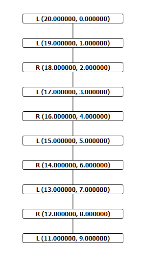
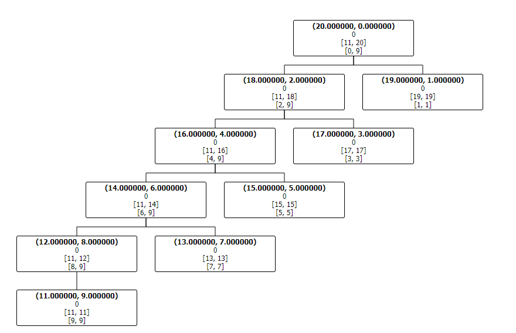
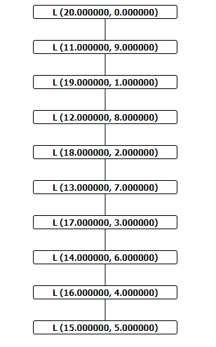
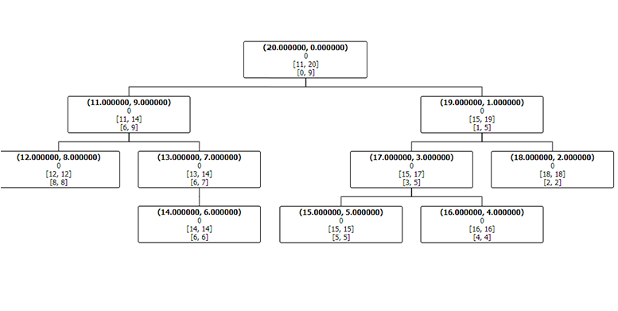
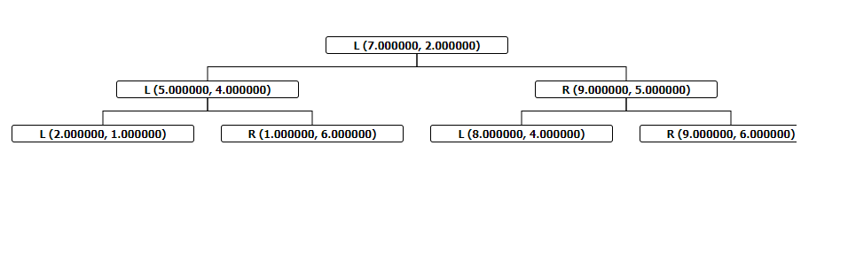
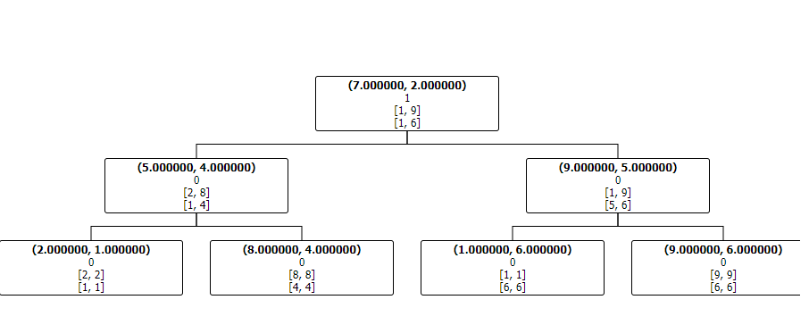

# Informe de Avance

De acuerdo a los pendientes de la lista:

- [ ] Modificar inserción (tomar en cuenta padre con un sólo hijo para empujarlo)

> Se produjo un problema al actualizar la forma en que se guarda la dimensión disjunta. Se tuvo que eliminar esta característica debido a que dejó de funcionar correctamente. Se va a replantear en la semana.

- [ ] Empujar padre si es contenido en un hijo (Pero el nuevo nodo no)
  
> Misma situación que el punto anterior. Replanteo en la semana.

- [x] Búsqueda comparando sólo una dimensión disjunta (previamente guardada)
  
> Ahora funciona correctamente y más eficiente.

- [ ] Implementar algoritmo de búsqueda pde los n vecinos más cercanos.
  
> Falta la implementación en el KD-Tree normal.

- [ ] Diseñar experimentos para comparar con KD-Tree original.
  
> Se adjuntan más abajo los experimentos iniciales.

- [ ] Realizar experimentos 😀

> Bajo cada experimento se mencionan los resultados obtenidos.

## Experimentos

### Experimentos de estructura: para medir que tanto mejora la profundidad del árbol.

- [ ] Datos extremos: Para el KD-Tree normal usar orden creciente.
  
- [ ] Extremos intercalados: Para forzar que nuestra implementación se incline a un sólo lado.

- [ ] Extremos intercalados 2: una dimensión que varía mucho y uno poco.

- [ ] La mejor distribución de datos para el KD-Tree normal.

- [ ] Medir tiempos de búsqueda en los experimentos anteriores.
  
 

Experimento 1: 2 Dimensiones, la primera decreciente y la segunda creciente

#### Con un KD-Tree Regular

#### Con nuestra implementación

Experimento 2: 2 Dimensiones, Intercalados:
> Puntos agregados en el siguiente orden:
> (20, 0)
> (11, 9)
> (19, 1)
> (12, 8)
> (18, 2)
> (13, 7)
> (17, 3)
> (14, 6)
> (16, 4)
> (15, 5)

#### Con KD-Tree regular

#### Con nuestra implementación

> De manera preliminar, se puede ver que incluso en el peor caso, nuestra implementación es mejor que el original.

Experimento 2: Una dimensión que varía mucho y una poco.

> Puntos agregados en el siguiente orden:
> (0, 0)
> (1, 10)
> (-2, -100)
> (3, 1000)
> (-4, -10000)
> (5, 100000)
> (-6, 1000000)
> (7, 10000000)
> (-8, -100000000)
> (9, 1000000000) 

numeros = {
            {0, 0},
            {1, 10},
            {-2, -100},
            {3, 1000},
            {-4, -10000 },
            {5, 100000},
            {-6, 1000000},
            {7, 10000000},
            {-8, -100000000},
            {9, 1000000000},
        };

Experimento 3: El mejor caso en el KD-Tree normal.

### Con KD-Tree Regular

### Con nuestra implementación

> Podríamos decir que en el peor de los casos, iguala en profundidad al KD-Tree original.

## Experimentos generales

- [ ] Simular colisiones en datos aleatorios.
- [ ] K-Nearest neighbors.
- [ ] Dominancia de puntos.
  