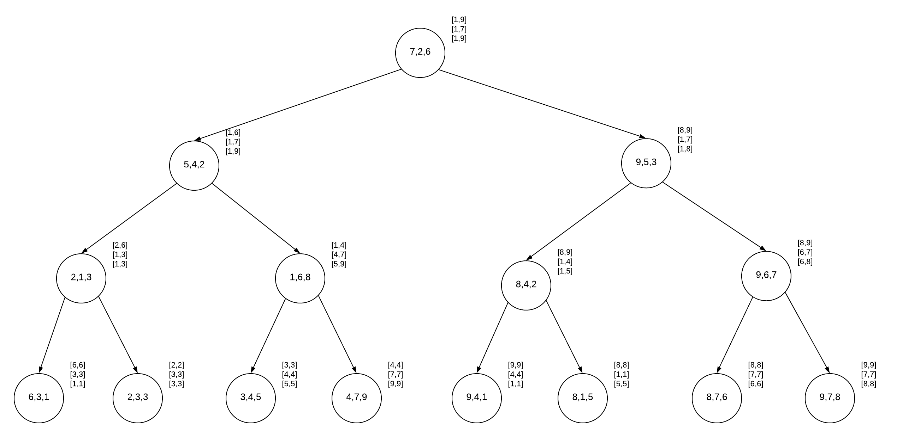
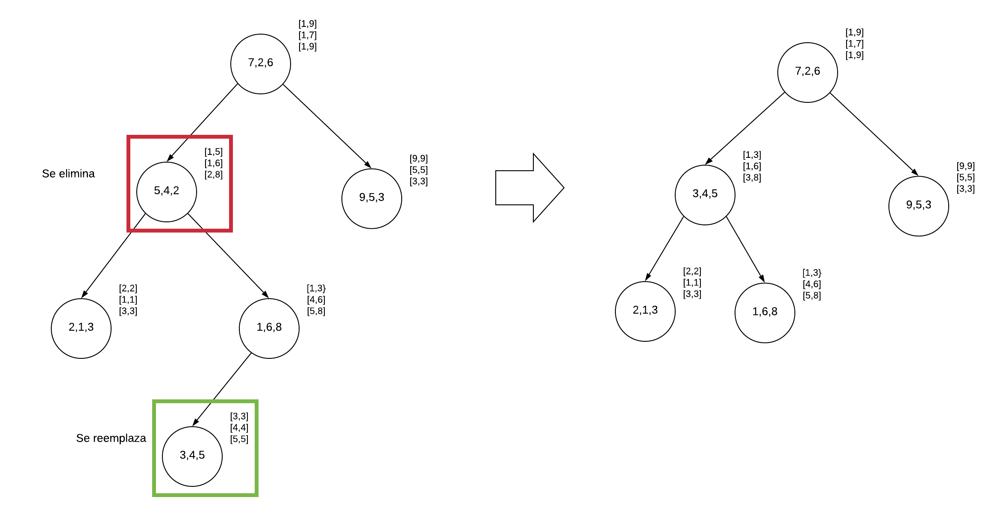
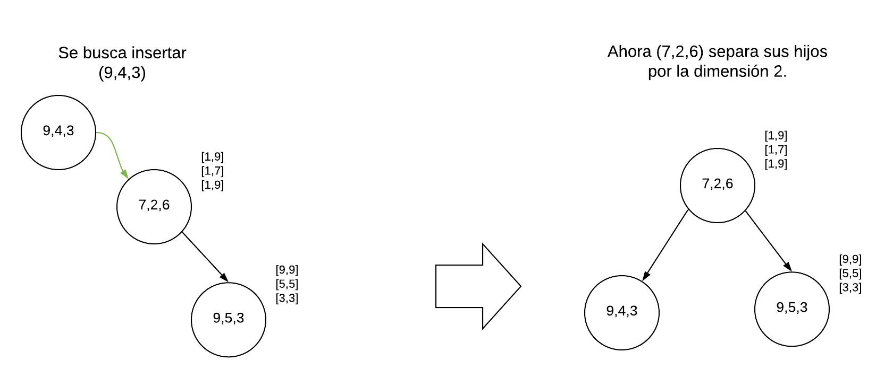

# Implementación de un KD-Tree en c++

Este repositorio contiene una propuesta de KD-Tree que intenta resolver el problema de esta estructura al eliminar e insertar muchos datos sobre este.

La estrategia utilizada comienza con guardar los rangos de cada sub árbol, en cada dimensión, en cada nodo.

Con esto, se pueden realizar acciones que permitan reducir la profundidad del árbol al momento de realizar eliminaciones e inserciones.

En este repositorio existen 3 variantes:

 1) Una versión genérica de KD-Tree.
 2) [Una primera versión modificada](#primera).
 3) [Una versión con aún más reglas](#segunda).

##  Primera versión

Esta versión está casi finalizada. Se aprovecha de la separación del valor de cada nodo del rango del sub-árbol para intentar reducir la profundidad mediante ciertas reglas en la eliminación e inserción.

### Eliminación

Al momento de eliminar un dato, este es reemplazado por el del nodo más profundo de su sub-árbol, para así reducir la profundidad.
Esto es posible gracias a que se utilizan rangos para las inserciones y búsquedas, en vez de los puntos de cada nodo.

### Inserción

Al momento de insertar un dato, se usan principalmente las reglas del KD-Tree normal, utilizando los rangos. La estrategia cambia en cuanto el dato a insertar no pertenece a ninguno de los rangos de los sub-árboles.
En este último caso, se realizan las siguientes comprobaciones:

1) Si alguno de los nodos es nulo, se inserta ahí.
2) Sino, se inserta en el sub árbol que contenga la menor profundidad.
3) Pendiente: hacer que priorice también el agrandar lo menos posible los rangos.

##  Segunda versión

Este es parecido en reglas a la primera versión, pero se diferencia en que la dimensión a comparar en cada nivel se elige al momento de que se inserte un nodo faltante (izquierda o derecha), intentando separar lo más posible los rangos. De esta manera se permite flexibilizar aún más la inserción dentro de esta estructura.

Gracias a esta regla evitamos aún más que aumente la profundidad del árbol, ya que de lo contrario se hubiera insertado en el sub árbol derecho.
